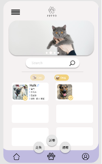
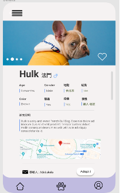
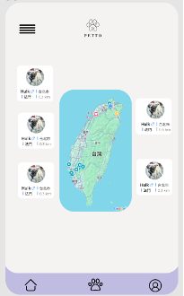
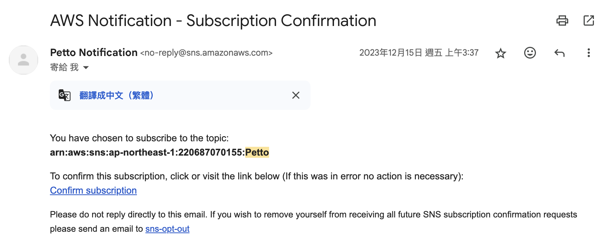
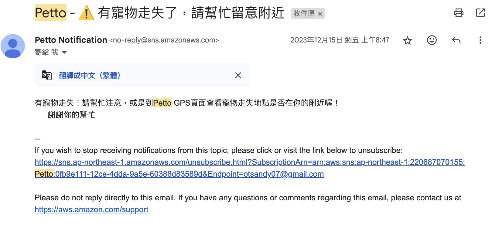
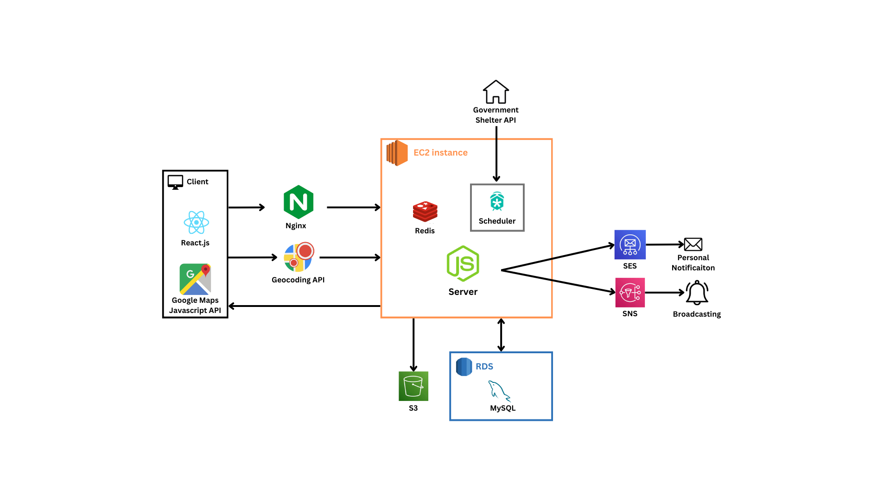

# Petto: Pets Adoption Integrated Platform

---
### Basic info
- Author: Li Hsuan Chen

- Skills:
    - React.js
    - Infinite Scroll
    - JavaScript
    - Google Maps Javascript API
    - Docker container
    - AWS(EC2/RDS/S3/SNS/SES)
    - RESTful API
    - ORM

### Main features
1. Notification
    - AWS SES(Amazon Email Simple Service)
        - Personal Matches Subscription - User subscribe to receive notification about the prferred type pets.
        - Adoptors can directly Message the Adoption Provider
    - AWS SNS: Group Subscription - Users will receive notifications in the event of a missing pet.
2. Display real-time adoption data
    - Display pets with various statuses on the map.
    - Determine the distance to the nearest pets within a 50 km radius.
3. Redis cache: Improved web data loading speed by 20x with Redis caching.
4. Integration with Government Shelters API

### Demo
- Home Page

- Pets Page

- Real-time adoption data

- Broadcasting

- Personal Notification

### Architecture

