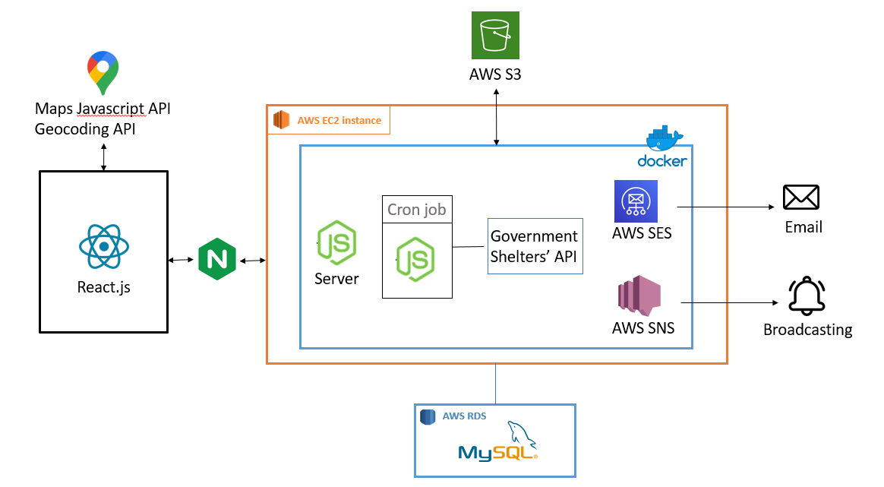

# Petto : A Pets Adoption integrated Platform
## Table of Contents

### Main features
1. Notification
    - Personal Matches Subscription : User subscribe to receive notification about the prferred type pets.
    - Group Subscription : Users will receive notifications in the event of a missing pet.
2. GPS
    - Display pets with various statuses on the map.
    - Determine the distance to the nearest pets within a 50 km radius.
3. Integration with Government Shelters API
4. Directly Message the Adoption Provider
    - AWS SES(Amazon Email Simple Service)

   
Technologies

### Architecture

Contact
